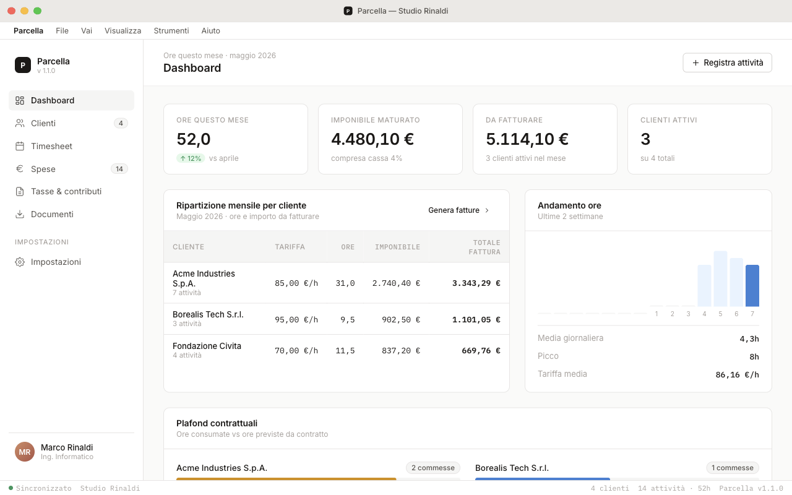
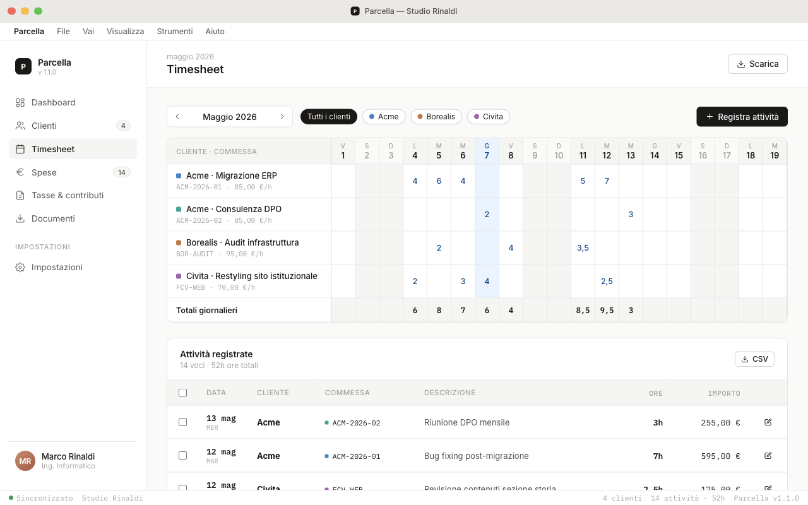
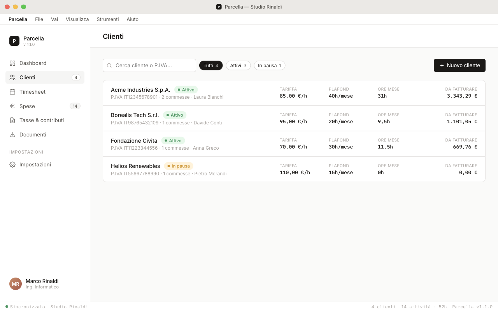
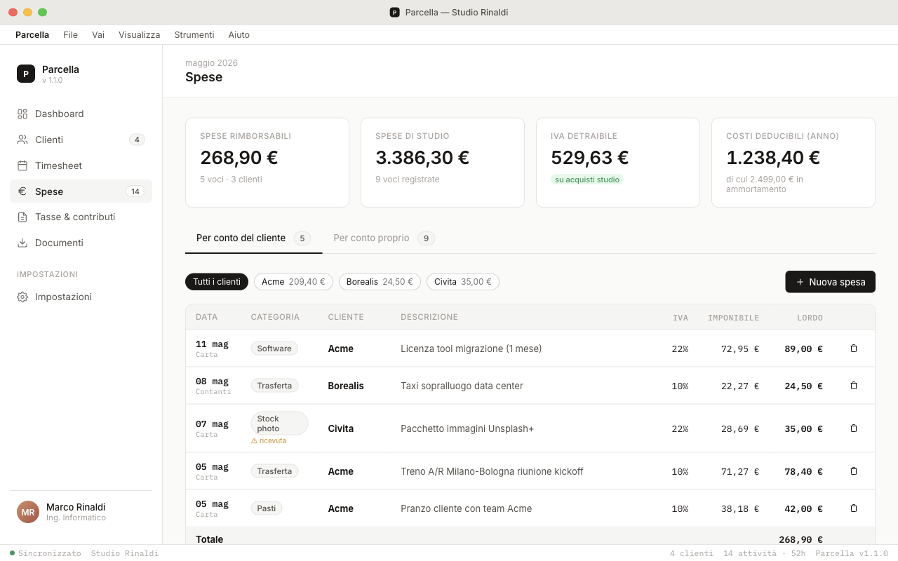
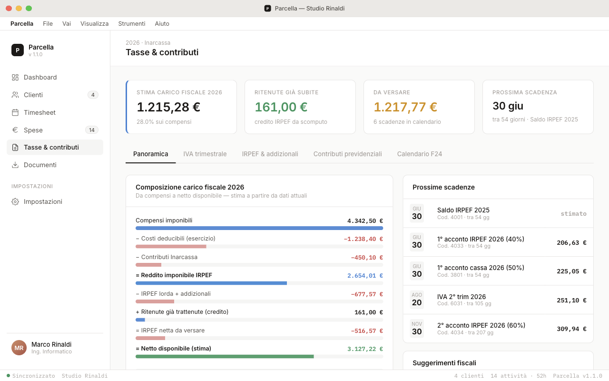
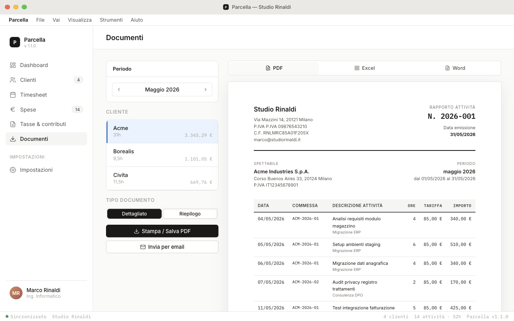
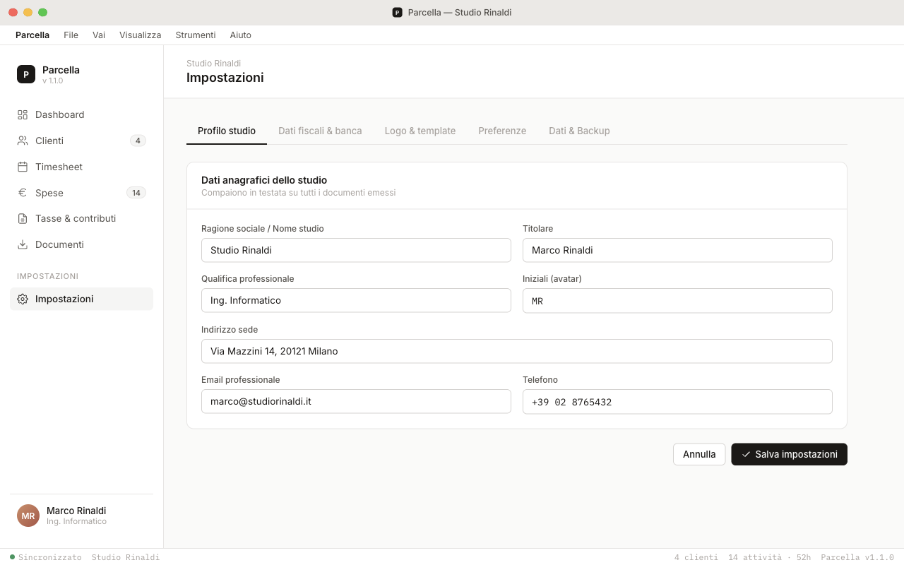

<h1 align="center">
  <br>
  
  <br>
  Parcella
  <br>
</h1>

<p align="center">
  <strong>Timesheet, invoicing and tax management for Italian freelancers</strong><br>
  Offline-first · No subscription · All data stays on your machine
</p>

<p align="center">
  
  
  
  
  
</p>

<p align="center">
  <a href="README.it.md">🇮🇹 Italiano</a>
</p>

---

Parcella is a native desktop app built with Electron that keeps **all your data local**. Track hours, manage clients, monitor expenses, estimate taxes and generate activity reports — without handing your financial data to any cloud service.

> Tailored for the Italian fiscal regime: supports *libero professionista*, *ditta individuale*, VAT (IVA), *cassa previdenziale*, *ritenuta d'acconto* and *regime forfettario*.

---

## Screenshots

### Dashboard


Monthly KPIs at a glance: hours logged, accrued revenue, amount to invoice and active clients. Per-client breakdown table with daily hours sparkline and contractual plafond tracking.

---

### Timesheet


Monthly grid with one row per client × project (*commessa*). Log hours by clicking individual day cells. Filter by client, export the full log as CSV.

---

### Clients


Client registry with hourly rate, active projects (*commesse*), contact manager, contractual hours plafond and current-month summary — all in a single list view.

---

### Expenses


Log studio and client-billable expenses. VAT detraction and deductibility are computed automatically per category. Filter by client or by expense type.

---

### Tax estimator


Annual tax and contribution waterfall: IRPEF, IVA quarterly balance, *cassa previdenziale* or INPS (fisso + variabile), upcoming F24 deadlines and net take-home estimate.

---

### Document generation


Generate formatted activity reports per client with a live preview. Export as PDF, Excel or Word. Send by email directly from the app.

---

### Settings


Studio profile, fiscal data, logo, document templates, preferences and encrypted backup — all in one place.

---

## Features

| Area | Details |
|---|---|
| **Timesheet** | Monthly grid, per-client / per-project rows, CSV export |
| **Clients** | Hourly rate, projects (*commesse*), contacts, plafond tracking |
| **Expenses** | Billable vs. deductible, VAT detraction, per-category deductibility |
| **Taxes** | IRPEF, IVA, *cassa* 4%, INPS, IRAP estimator — updated annually |
| **Documents** | PDF, Excel, Word with live preview, email sending |
| **Backup** | AES-256-GCM encrypted export; cloud sync: iCloud, Dropbox, Google Drive, OneDrive |
| **Offline** | All data in local SQLite — no account, no internet required |
| **i18n** | Italian and English UI |

---

## Tech stack

| Layer | Technology |
|---|---|
| Shell | [Electron](https://electronjs.org) v35 |
| UI | [React](https://react.dev) via Babel (no bundler) |
| Database | [better-sqlite3](https://github.com/WiseLibs/better-sqlite3) — synchronous SQLite |
| Keychain | [keytar](https://github.com/atom/node-keytar) — system keychain for backup passphrase |

---

## Getting started

### Prerequisites

- Node.js ≥ 18
- macOS, Windows or Linux

### Run in development

```bash
npm install
npm start
```

### Build distributable

```bash
# macOS (DMG + ZIP, x64 and arm64)
npm run dist:mac

# Windows (NSIS installer + portable)
npm run dist:win

# Linux (AppImage + .deb)
npm run dist:linux

# All platforms
npm run dist:all
```

Output goes to `dist/`.

---

## Project structure

```
src/
  main/
    main.js        # Electron main process (IPC, DB, backup, crypto)
    preload.js     # contextBridge — exposes window.api and window.APP_VERSION
    db.js          # SQLite via better-sqlite3
    db-json.js     # JSON fallback when SQLite is unavailable
  renderer/
    index.html     # HTML shell, loads vendor scripts + components
    app.jsx        # Root React component, state, routing
    i18n.js        # Translations (it/en)
    storage.js     # LocalStorage persistence helpers
    data.js        # Default data structures
    styles.css     # Global styles
    components/
      shared.jsx        # Layout (Sidebar, Topbar, Modal, Toast) + shared utilities
      dashboard.jsx     # Dashboard view
      timesheet.jsx     # Monthly timesheet grid
      clients.jsx       # Client list and detail
      expenses.jsx      # Expense tracking
      taxes.jsx         # Tax & contribution estimator
      export.jsx        # Document generation
      settings.jsx      # App settings and backup
      icons.jsx         # SVG icon set
vendor/             # Vendored React, Babel (no CDN dependency)
```

---

## Data and privacy

All data is stored in a SQLite database in the OS user-data directory. No telemetry. No network calls. No account required.

| Platform | Path |
|---|---|
| macOS | `~/Library/Application Support/Parcella/timesheet.db` |
| Windows | `%APPDATA%\Parcella\timesheet.db` |
| Linux | `~/.config/Parcella/timesheet.db` |

### Backup

Go to **Settings → Dati & Backup** to:

- Export an encrypted `.parcella` backup (AES-256-GCM, passphrase stored in system keychain)
- Sync directly to iCloud Drive, Dropbox, Google Drive or OneDrive (if the client folder is present on disk)
- Import and restore from any previous backup

---

## License

[MIT](LICENSE)
